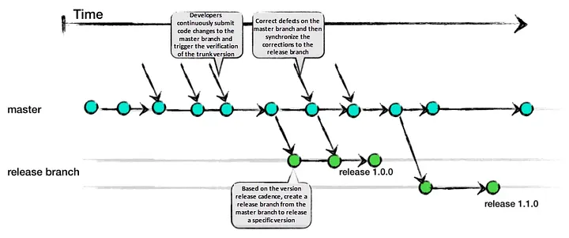
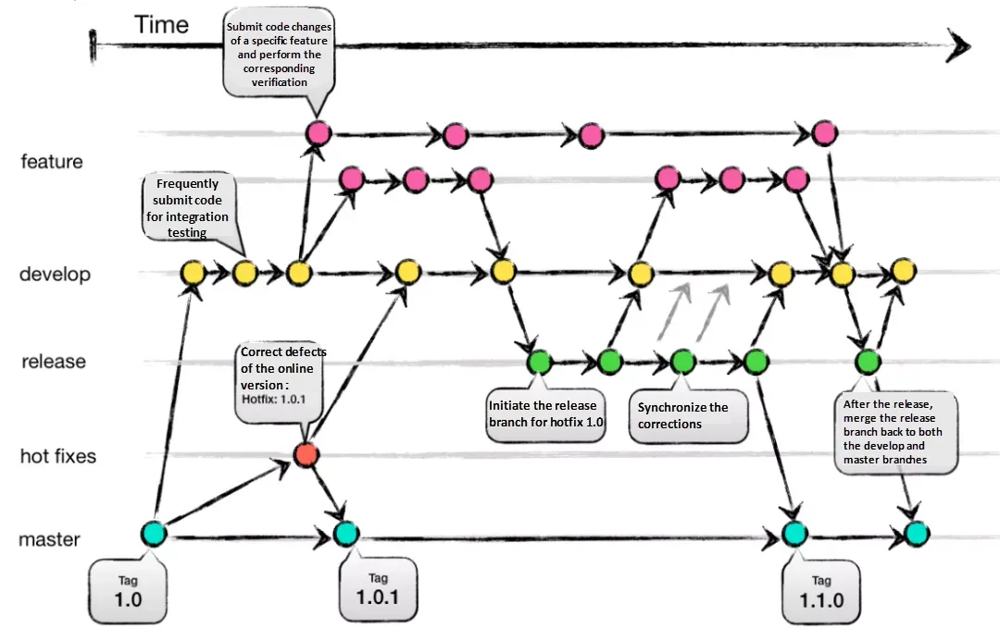
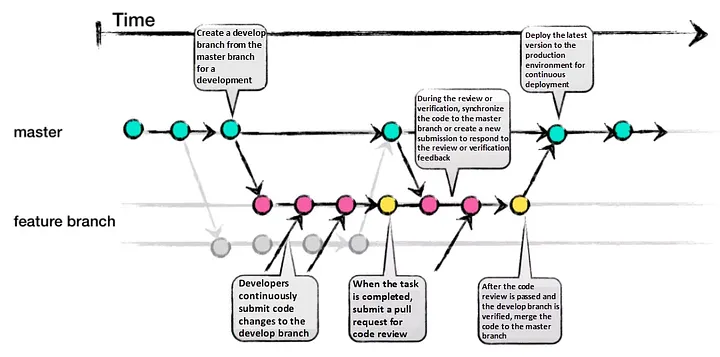
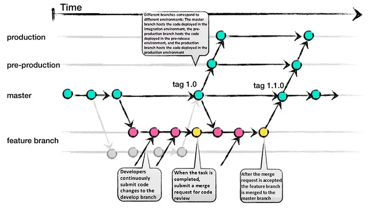

# General

*Philosophy: consistency and automation*

## Machine Learning Components

- Infrastructure

- Data ingress (ETL / ELT / ETLT pipeline)

- Data quality monitoring

- Data egress

- Data security and governance

- Model training

- Model evaluation (after training)

- Model deployment

- Model serving

- Model performance degradation monitoring

- Model registry

- Service monitoring

- Experiment tracking

- Code version control

Most of the tasks needs to run without human intervention.

## External System Interfaces

1. **Data ingress**: There can be several external data sources. These are either going to be direct access to the database or APIs. Receiving direct read-only access would require the least amount of work on the database owner's side, but an API could also be provided. In the latter case data sanitization could be more reliably achieved, for example in case of sensitive data. I would assume this to be a pull configuration on our end. The external data sources are "done", our system is the new one, therefore most of the development happens on our end.

2. **Data egress**: We are developing a backend service, so there is no user facing interface. The outputs of our models needs an access points for other services which desire to use them. The situation seems to be reversed compared to data ingress. We could either give direct read-only access to our data, provide an API through which external services could poll them, or we could write to an external database / call an external API to the services depending on us.

3. **Model serving**: Certain tasks could arise which would require us to directly expose our models. I am aware at the moment whether there will be a need for this interface or not.

## Model Representation

In the name of consistency we can choose between three strategies.

1. Standard model format

2. Native model format

3. Custom model format

The first option is to choose and use a industry standard model representation format, for example ONNX. Using a standard format would mean that after training the model, we would need to insert a compilation step into the process. This could either be a simple function call converting only the model, or compiling the data preprocessing/transformation pipeline with the model. Technically this is not too much of an overhead. Libraries exist to do this conversion, so it should be no more than a couple lines of code.

The second option would be to keep all models in their original "native" format. This would mean that the stored sklearn models would differ for example from tensorflow models. This would mean that anytime we might use these models, we would need to use different interfaces they provide. I am not yet sure if it would affect a model serving service or not. If we are writing our own model serving service, then it deffinitly would be extra overhead to handle the differences.

The third option is to create our own representation format. In theory it would provide the most flexibility/customizability, but would need the most time to develop and test it. If we build our own model serving service, then it wouldn't be an issue, but we might encounter some issues when using other platforms.

The most important part of choosig the representation is to have all models provide the same interface, therefore they could be swapped in-and-out on the serving side without need to adjust any other component of the system. 

## Model repository

To store the models, we could use some generic cloud storage combined with DVC for example or use a something like Unity Catalog provided by Databrics, wich can also be configured to use a cloud storage. It is probably the best to choose the model repository after we pinned down the model serving solution. External model serving services most likely have a preferred repository wich would be the easiest to integrate.

## Model deployment

Here the name of the game is automation, but the solution is highly dependent on the model serving just like the model repository is. Model training might be triggered either manually or by some automation. The trained models are "compiled" into the chosen representation format, then uploaded to the repository. This is where the deployment process starts. Uploading a new model to the repository shall trigger the deployment of that model. Depending on the type of service the model provides and the number of models deployed, they can be swapped with some downtime, or we can use a standard deployment strategy (Big Bang, Rolling, Blue-Green). Easiest approach would be to introduce some downtime while swapping the served model, or to deploy the new model alongside the old one, then remove the old model.

## Infrastructure

Self-hosted, custom cloud solution or off-the-shelf cloud solution?

Anything can be self-hosted, most if not all components have an open source, free software solution, but usually self-hosting means a lot of overhead throughout the projects lifecycle. Setting up the infrastructure, configuring it, managing and monitoring are very time demanding.

Custom cloud solutions are what AWS, Azure, etc. provides for hosting a VM or containers. These don't require management of hardware, the networking is usually no more than configuration, and managing/scaling/monitoring is well supported.

Using off-the-shelf cloud solutions (like Databricks) come with the benefit of being tailored to a specific task. Most of the infrastructure is managed by these platforms and require the least amount of setup and active management. Components like data storage, model repository, model serving are all set up almost ready to use.

## Service monitoring

In this section the focus is on service availability, health, traffic, throughput, scaling and other regular DevOps, non-ML questions. The route we take is tightly connected to the infrastructure. The only thing most likely everyone can agree on is that developing a custom solution here is out-of-scope. Either use an open source solution like Grafana, or use whatever the chosen cloud platform provides/prefers. Monitoring and alerting are usually built in to cloud platforms.

## Code Version Control

It is git. Here the question is not what do we use, but how do we use it. The three main parts we need to define are:

 - branching strategy
 - code contribution
 - folder structure

### Branching Strategy

#### Trunk Based Development:
Trunk Based Development promotes a single shared branch called “trunk” and eliminates long-living branches. There are two variations based on team size: smaller teams commit directly to the trunk, while larger teams create short-lived feature branches. Frequent integration of smaller feature slices is encouraged to ensure regular merging.

Pros:
- Encourages DevOps and unit testing best practices.
- Enhances collaboration and reduces merge conflicts.
- Allows for quick releases.

Cons:
- Requires an experienced team that can slice features appropriately for regular integration.
- Relies on strong CI/CD practices to maintain stability.



#### Git-Flow:

Git-Flow is a comprehensive branching strategy that aims to cover various scenarios. It defines specific branch responsibilities, such as main/master for production, develop for active development, feature for new features, release as a gatekeeper to production, and hotfix for addressing urgent issues. The life-cycle involves branching off from develop, integrating features, creating release branches for testing, merging into main/master, and tagging versions.

Pros:
- Well-suited for large teams and aligning work across multiple teams.
- Effective handling of multiple product versions.
- Clear responsibilities for each branch.
- Allows for easy navigation of production versions through tags.

Cons:
- Complexity due to numerous branches, potentially leading to merge conflicts.
- Development and release frequency may be slower due to multi-step process.
- Requires team consensus and commitment to adhere to the strategy.



#### GitHub-Flow:
GitHub-Flow simplifies Git-Flow by eliminating release branches. It revolves around one active development branch (often main or master) that is directly deployed to production. Features and bug fixes are implemented using long-living feature branches. Feedback loops and asynchronous collaboration, common in open-source projects, are encouraged.

Pros:
- Faster feedback cycles and shorter production cycles.
- Ideal for asynchronous work in smaller teams.
- Agile and easier to comprehend compared to Git-Flow.

Cons:
- Merging a feature branch implies it is production-ready, potentially introducing bugs without proper testing and a robust CI/CD process.
- Long-living branches can complicate the process.
- Challenging to scale for larger teams due to increased merge conflicts.
- Supporting multiple release versions concurrently is difficult.



#### GitLab-Flow:
GitLab-Flow strikes a balance between Git-Flow and GitHub-Flow. It adopts GitHub-Flow’s simplicity while introducing additional branches representing staging environments before production. The main branch still represents the production environment.

Pros:
- Can handle multiple release versions or stages effectively.
- Simpler than Git-Flow.
- Focuses on quality with a lean approach.

Cons:
- Complexity increases when maintaining multiple versions.
- More intricate compared to GitHub-Flow.



[Source for the branching strategies above](https://medium.com/@sreekanth.thummala/choosing-the-right-git-branching-strategy-a-comparative-analysis-f5e635443423)


### Contribution guide

### Folder structure

```
ml_project/
├── data/
│   ├── raw/               # Raw data (input)
│   ├── processed/         # Processed/cleaned data
│   ├── external/          # External datasets (optional)
│   └── README.md          # Description of the data structure
├── notebooks/
│   ├── exploratory.ipynb   # Exploratory Data Analysis (EDA)
│   ├── modeling.ipynb     # Experimentation and modeling
│   └── README.md          # Guidelines for notebooks
├── src/
│   ├── __init__.py        # Package initialization
│   ├── data/              # Data loading/processing scripts
│   │   ├── __init__.py
│   │   └── preprocess.py
│   ├── models/            # Model training and evaluation scripts
│   │   ├── __init__.py
│   │   └── train.py
│   ├── utils/             # Utility functions
│   │   ├── __init__.py
│   │   └── helpers.py
│   └── README.md          # Description of the `src` folder
├── tests/
│   ├── test_data.py       # Unit tests for data processing
│   ├── test_models.py     # Unit tests for models
│   └── README.md          # Description of the `tests` folder
├── models/
│   ├── saved/             # Serialized models
│   ├── artifacts/         # Training artifacts (e.g., logs, configs)
│   └── README.md          # Model storage guidelines
├── reports/
│   ├── figures/           # Visualizations and plots
│   └── README.md          # Description of reports
├── configs/
│   ├── config.yaml        # General configuration file
│   ├── train.yaml         # Training-specific configurations
│   └── README.md          # Description of config files
├── .gitlab-ci.yml         # GitLab CI/CD pipeline configuration
├── requirements.txt       # Python dependencies
├── environment.yml        # Conda environment (optional)
├── setup.py               # For packaging the project as a module
├── README.md              # High-level project description
├── LICENSE                # License for the project
└── .gitignore             # Files to ignore in Git
```
